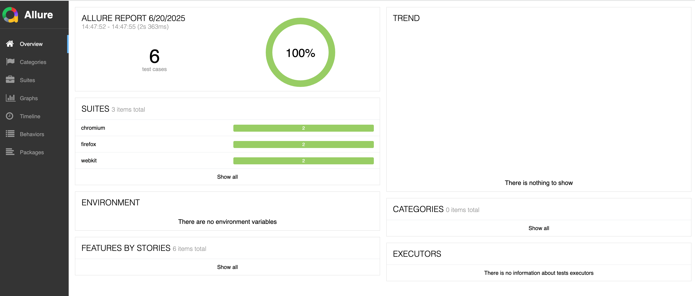
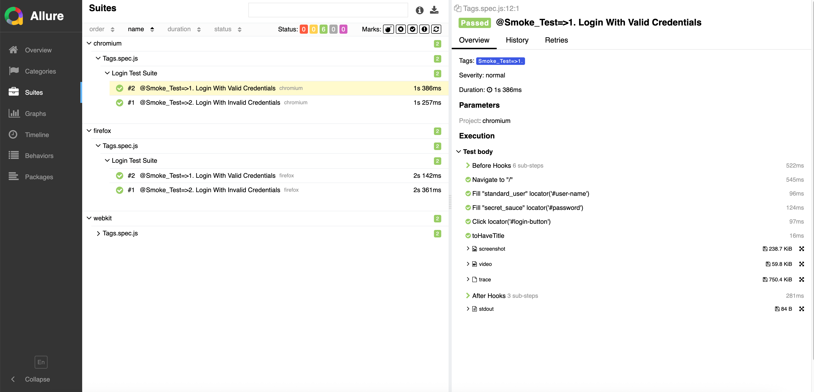
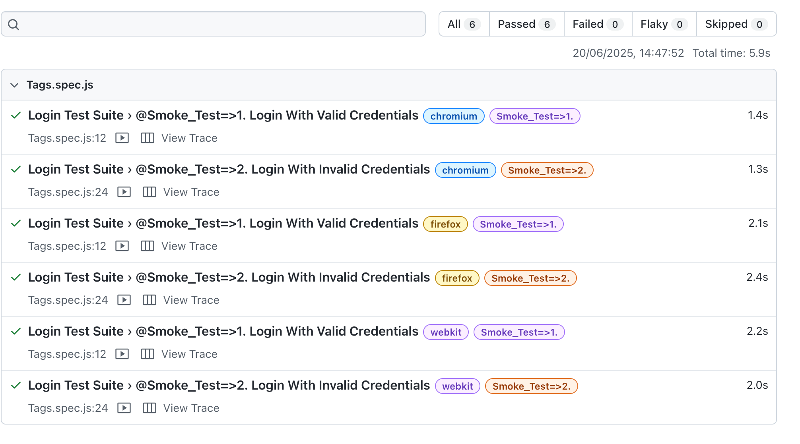
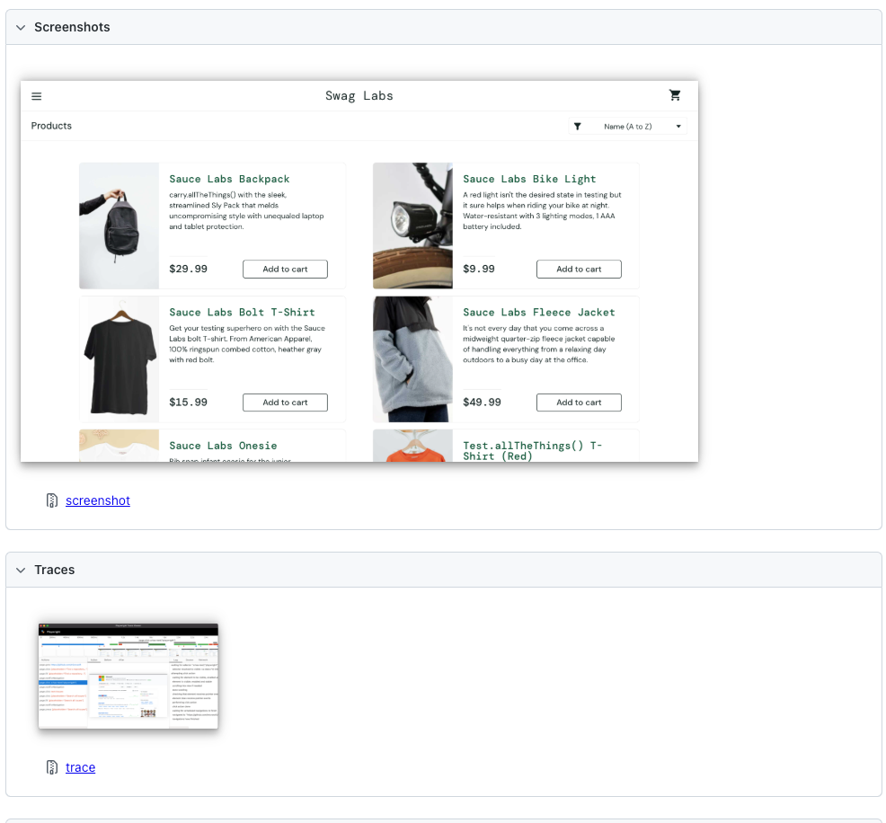
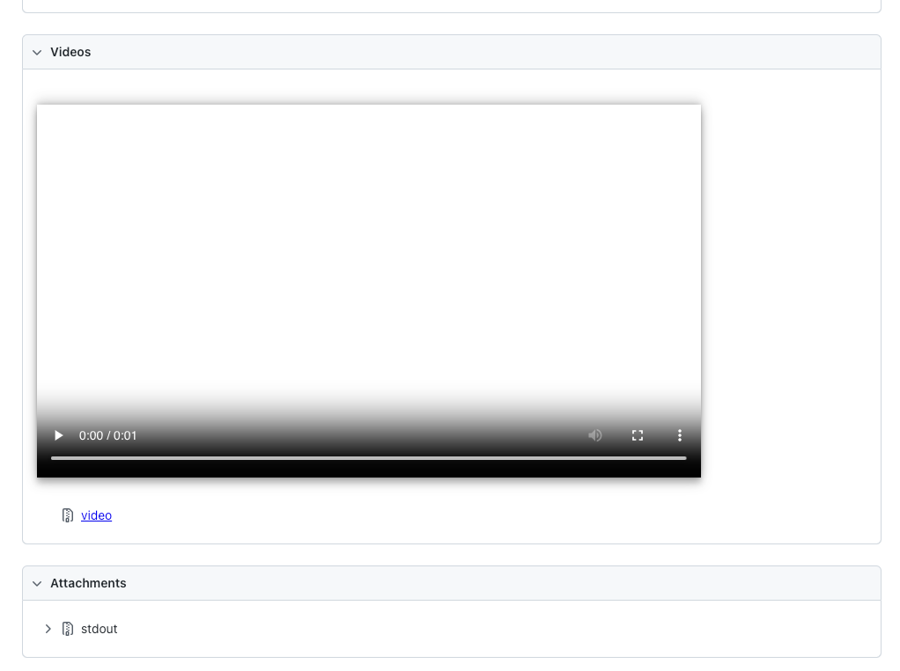
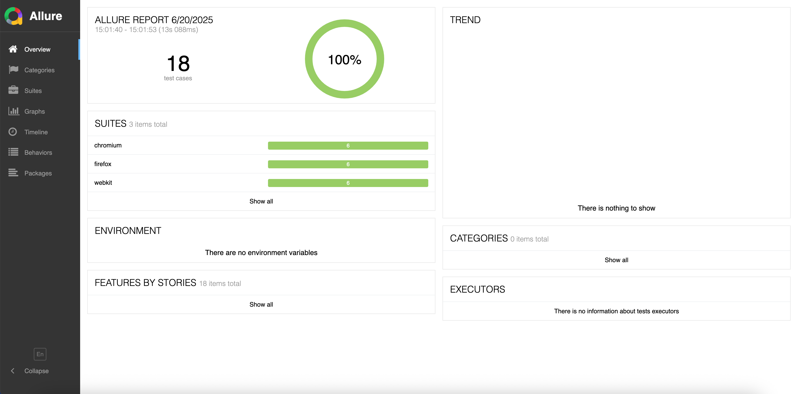

# Playwright Documentation Link
1. Playwright Tutorial Full Course - https://playwright.dev/docs/intro

#### Install Playwright & Select Configurations
- npm init playwright@latest

Playwright will download the browsers needed as well as create the following files.

- node_modules
- playwright.config.js
- package.json
- package-lock.json
- tests/
    example.spec.js
- tests-examples/
    demo-todo-app.spec.js

  
#### dotenv Package Installation Command
- npm install dotenv --save

#### csv-parse Package Installation Command
- npm install csv-parse

#### faker-js plugin for test data generation
- npm install @faker-js/faker --save-dev

#### luxon plugin for custom dates
- npm install --save luxon

## How to update to playwright to the latest version
- npm install -D @playwright/test@latest
- npx playwright install --with-deps     #Also download new browser binaries and their dependencies:

## Playwright Important Commands

  npx playwright install
   - Install Browsers manually.
    
  npx playwright test
   - Runs the end-to-end tests.

  npx playwright test --ui
   - Starts the interactive UI mode.

  npx playwright test --project=chromium
   - Runs the tests only on Desktop Chrome.

  npx playwright test example
  -  Runs the tests in a specific file.

  npx playwright test --debug
  - Runs the tests in debug mode.

  npx playwright codegen
- Auto generate tests with Codegen.

We suggest that you begin by typing:

    npx playwright test

### And check out the following files:
  - ./tests/Pomtest.spec.js - Sample Page Object Model =>end-to-end test (npx playwright test Pomtest.spec.js --project=chromium)
  - ./tests/Tags.spec.js - Sample to run Smoke Test and Regression Suite =>end-to-end tests(npx playwright test Tags.spec.js  --grep @Smoke_Test OR npx playwright test Tags.spec.js  --grep @Regression_Test)
  - ./tests/Grouping.spec.js - Sample Grouping and Hooks =>end-to-end tests (npx playwright test Grouping.spec.js --project=chromium)
  - ./tests/DynamicElements.spec.js - Sample to handle Dynamic Elements
  - .\playwright.config.js - Playwright Test configuration

## Allure Report with Playwright [Screenshots, Videos & Traces]
- Step1: Install Allure Report command-line tool
  ### npm install -g --save-dev allure-commandline
  
- Step2: Install the Allure Playwright adapter.
  ### npm install --save-dev allure-playwright

- Step3: Add below config in playwright.config.js file.
  ### reporter:[
  ### ['html'],
  ### ['allure-playwright']
  ### ],

- Step4: Run Playwright tests.
  ### npx playwright test

- Step5: Generate Allure Report
  ### npx allure serve allure-results

  or

  ### allure generate allure-results --clean
  ### allure open

 ### Sample Smoke Test Results => Allure Screenshots
 ### Trace
 ### Screenshots
 ### Video



## Playwright Test Report
 ### Sample Smoke Test Results
 ### Trace
 ### Screenshots
 ### Video




 ### Sample Regression Test Results => Allure


## Integrate Playwright with Azure Devops Pipeline
There are 2 options, option1 is using yaml file & option2 is without using yaml file. let's see one by one

1. Option1 - Using YAML File
   - Step1: Create a new project in ADO then Click on Project
     
   - Step2: Click on Repos & Let's create new repository, Click on New reposiotry
    
   - Step3: Enter Repository name & Click on Create
  

   - Step4: Click on Clone button and get the URL. Go to your system then clone repository.
   - Step5: Add all the playwright framework folders inside cloned repository
    

   - Step6: Push all the folders into Azure devops
    

   - Step7: Repository is ready now, let's create pipeline. Click on Pipelines->Create Pipeline


   - Step8: Click on Azure Repos Git
    

   - Step9: Select previously created repository
    

   - Step10: Select Starter Pipeline
    

   - Step11: Copy below yaml content and paste it inside azure-pipelines.yml file. 
```
trigger:
- main

pool:
  vmImage: ubuntu-latest

steps:
- task: NodeTool@0
  inputs:
    versionSpec: '18'
  displayName: 'Install Node.js'
- script: npm ci
  displayName: 'npm ci'
- script: npx playwright install --with-deps
  displayName: 'Install Playwright browsers'
- script: npx playwright test
  displayName: 'Run Playwright tests'
  env:
    CI: 'true'
```
If you are running in self hosted agent replace pool commands
```
pool:
   name: AgentPoolName
   demands:
   - agent.name -equals AgentName
```
   - Step12: Click on Save and run

   - Step13: You will see job queued like this.

   - Step14: Click on Job & Verify build status.

   - Step15: Now let's Upload playwright-report folder with Azure Pipelines & Report generation
     Firstly update azure-pipelines.yml file
```
trigger:
- main

pool:
  vmImage: ubuntu-latest

steps:
- task: NodeTool@0
  inputs:
    versionSpec: '18'
  displayName: 'Install Node.js'
- script: npm ci
  displayName: 'npm ci'
- script: npx playwright install --with-deps
  displayName: 'Install Playwright browsers'
- script: npx playwright test
  displayName: 'Run Playwright tests'
  env:
    CI: 'true'

- task: PublishTestResults@2
  displayName: 'Publish test results'
  inputs:
    searchFolder: 'test-results'
    testResultsFormat: 'JUnit'
    testResultsFiles: 'e2e-junit-results.xml'
    mergeTestResults: true
    failTaskOnFailedTests: true
    testRunTitle: 'My End-To-End Tests'
  condition: succeededOrFailed()
- task: PublishPipelineArtifact@1
  inputs:
    targetPath: playwright-report
    artifact: playwright-report
    publishLocation: 'pipeline'
  condition: succeededOrFailed()
```
     
   - Step16: Verify playwright-report folder attachment & report.
       From job we can navigate into artifacts folder. Download playwright report and verify results.

2. Option2 - Without using YAML File
   - Step1: Repeat step 1 to 6 above from Option1
   - Step2: Click on Pipelines then click on New Pipeline

   - Step3: Click on Use the classic editor & Click on Continue

   - Step4: Click on Emtpy job

   - Step5: Click on + icon, Search for Node and add Node.js tool installer


   - Step6: Select just now added task and add Node v16 becuase playwright supports for Node v14 and above

   - Step7: Click on + icon, Similary add Command line task,
     Display name: Install Playwright & Dependencies
     Script: npm install && npx playwright install
    
     Click on Advanced-> Click on little icon(i) & select the Link. This will enable working directory for the task.

   - Step8: Add another task by clicking on + icon, search for npm & Add npm

     Enter Display name, Select Command as custom & Enter Command and Arguments as run tests

     In this task we are referring to the package.json file.
  

   - Step9: Once everthing is completed now it is a time run script. Click on Save & queue.

    Add commit message then click save & run.
   
   - Step10: It looks like this

     Click on Job and you will see a screen like this

   - Step11: We can also upload playwright-report using Publish Pipeline Artifacts task

   - Step12: Let's Publish Test Results using Publish Test Results task


   - Let's run the pipeline

   - Artifacts are published & also we have published test results

    


  
  
